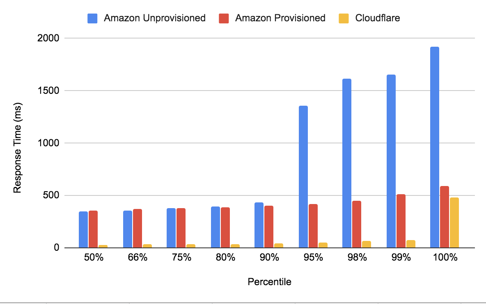
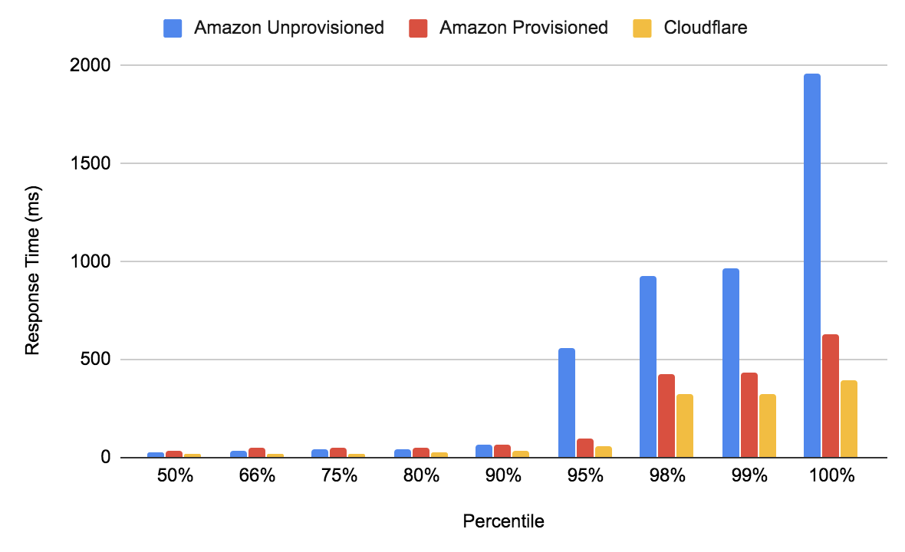
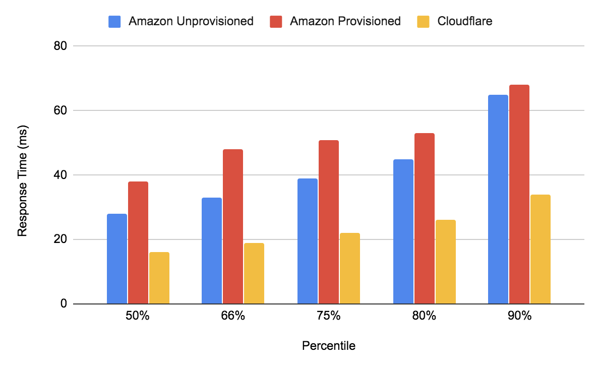
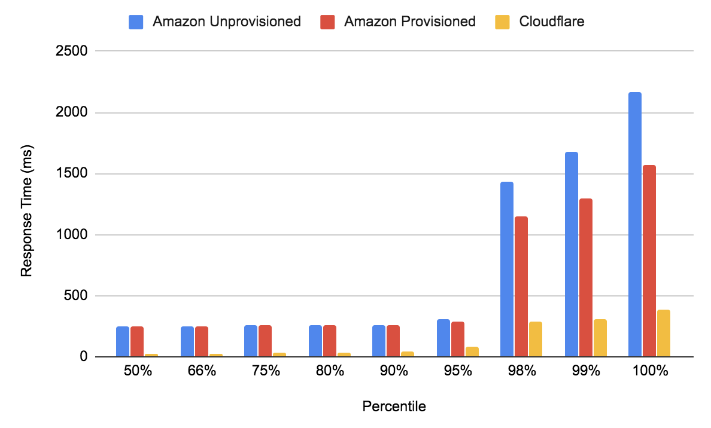
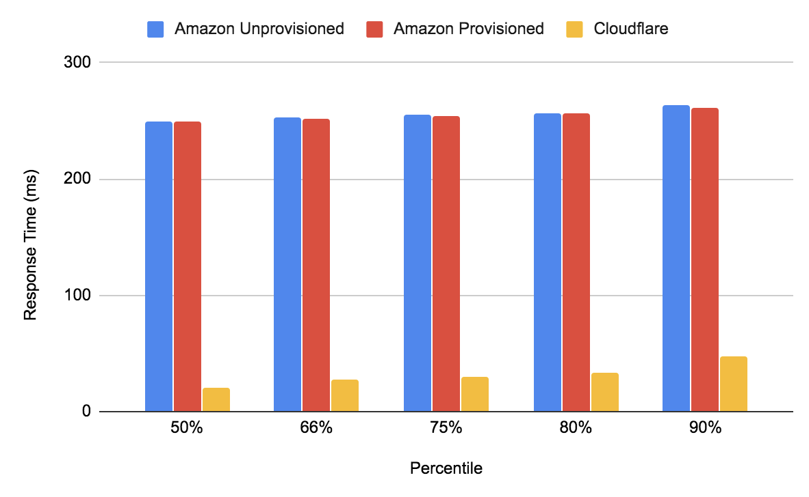

Serverless functions commonly require ‘cold-starts’. A cold-start represent when a new copy of your
serverless function must be started, resulting in a request which takes much longer than it should.
Most serverless platforms require a cold-start for every increase in concurrency your function will
support, if you can have 500 requests in process at a time, every deploy will require at least 500
cold-starts.

Earlier this week AWS Lambda launched its Provisioned Concurrency feature which allows customers to
pay for a minimum number of always-running Lambda functions. Given that our Serverless platform,
Workers, generally performs cold-starts around 100x faster than a Lambda, we wanted to learn if this
new feature would significantly change the economics or performance of choosing Workers. To find out
we performed the same analysis they did in their [launch blog
post](https://aws.amazon.com/blogs/aws/new-provisioned-concurrency-for-lambda-functions/) and will
reveal the results here.

# Reproducing The Test

Unfortunately their test code is not (to my knowledge) open-source, so we will have to reproduce it
as well as we can. They describe their test as:

"To simulate a production workload, these functions are repeating some mathematical computation 10
million times in the initialization phase and 200,000 times for each invocation."

This test is ran using Apache Bench, testing the endpoint ten thousand times with a maximum of five
hundred tests running simultaneously. The test is ran both with Amazon’s provisioned concurrency
feature disabled, and with it enabled. We will also run the test using a Worker as the backend.

Here is how I mapped that to a Worker:

```javascript
let initialized = false

addEventListener('fetch', event => {
 event.respondWith(handleRequest(event.request))
})

/**
* Respond to the request
* @param {Request} request
*/

async function handleRequest(request) {
 let val = 0
 if (!initialized){
   for (let i=0; i < 10000000; i++){
     val = Math.random() * 1000 | 0
   }

   initialized = true
 }

  for (let i=0; i < 200000; i++){
   val = Math.random() * 1000 | 0
 }

 return new Response(val, {status: 200})
}
```

Again we would love a copy of their actual code to confirm what we’re doing is correct.

To ensure we get proper cold starts, I made and deployed a trivial change to the Worker script
before running our test. As in their test, we run ten thousand requests, with up to five hundred
running concurrently. We are running our test from a VM in Amazon’s us-east-1 region, but as all
Workers are deployed to 195 data centers, performance would be similar anywhere on Earth:

```bash
ab -n 10000 -c 500 [http://cloudflare.london/provisioned/](http://hate.io/provisioned/)
```

```bash
Connection Times (ms)

              min  mean[+/-sd] median   max
Connect:        6    8   1.2      8      18
Processing:    13   24  16.4     20     472
Waiting:       13   23  16.2     20     472
Total:         20   32  16.4     28     480

Percentage of the requests served within a certain time (ms)
  50%     28
  66%     31
  75%     34
  80%     36
  90%     42
  95%     51
  98%     65
  99%     77
 100%    480 (longest request)
```



As expected some percentage of requests do initialize a new Worker. Since their script stipulates
that on cold-start the code runs ten million extra iterations, we see that as diminished performance
above the 99th percentile. If we modify the Worker to not be specially slow on cold-starts, so we
are really seeing the performance of the platform not our code, we get:

```javascript
addEventListener('fetch', event => {
 event.respondWith(handleRequest(event.request))
})

/**
* Respond to the request
* @param {Request} request
*/

async function handleRequest(request) {
 let val = 0
 for (let i=0; i < 200000; i++){
   val = Math.random() * 1000 | 0
 }

 return new Response(val, {status: 200})
}
```

```bash
Connection Times (ms)

              min  mean[+/-sd] median   max
Connect:        6    8   0.7      8      12
Processing:    13   23  12.5     19     242
Waiting:       13   22  12.1     19     231
Total:         20   30  12.5     27     250

Percentage of the requests served within a certain time (ms)

  50%     27
  66%     29
  75%     32
  80%     34
  90%     42
  95%     50
  98%     66
  99%     78
 100%    250 (longest request)
```

Originally we wrote our comparison Lambda in JavaScript, but after struggling to reproduce their
results I bit the bullet and wrote some Java 11:

```java
package com.cloudflare.aws;

import com.amazonaws.services.lambda.runtime.Context;
import com.amazonaws.services.lambda.runtime.RequestHandler;
import java.util.Collections;
import java.lang.Math;

public class LambdaJavaAPI implements RequestHandler<Object, GatewayResponse> {
    @Override
    public GatewayResponse handleRequest(Object object, Context context) {
        int j = 0;
        for (int i=0; i < 200000; i++){
          if (Math.random() > 0.5){
            j++;
          }
        }

        GatewayResponse response = new GatewayResponse(
                String.valueOf(j),
                200,
                Collections.singletonMap("X-Powered-By", "Lambda"),
                false
        );

        return response;
    }
}
```

This script is again skipping the 10 million iteration initialization pass, as we’re interested in
the performance of the platform itself.

Our initial tests showed extreme 100th percentile values due to the overhead of forming an HTTPS
connection. We eventually added the `-k` flag to Apache Bench which reuses connections to limit it,
and got confirmation from Amazon that was what they did as well. They also informed us their post
was based on the best of several iterations so we did a similar thing, rerunning the test on their
behalf until we got numbers similar to their test:



As in Amazon’s test, I am using Lambdas with 1 GB of memory. Amazon scales the CPU performance of a
Lambda based on the amount of memory. By looking at the percentiles which don’t require Amazon to do
a cold start we can confirm that a Worker provides about 2x the CPU performance of a 1 GB Lambda:



Again these tests were being ran from us-east-1, where the Lambda is also deployed. This is very
advantageous for Amazon, as the tests heading out to Cloudflare have to leave their data center,
while the Lambda tests do not. I’m currently writing this post not from the US, however, I’m in our
Singapore office. To test the performance from here I launched a new testing VM in Amazon’s
ap-southeast-1 region:



The Worker is more than 3x faster than the Lambda, provisioned or otherwise, in every percentile
bucket. In the percentiles most users will see the difference is even more stark:



A full half of users will experience the Worker as being more than 11x faster than the Lambda.

# Cost

Calculating the cost of a Lambda is challenging. It is based on a metric called GB-s, which
represents the memory allocated multiplied by the number of seconds of CPU time consumed. As we
mentioned, the speed of that CPU varies with the amount of memory allocated. Additionally the amount
of CPU used is rounded up to the nearest 100ms, meaning every invocation is overcharged by an
average of 50ms.

My Java Lambda consumed around 6ms when the function was warm, but I was billed for the minimum of
100ms. Given it was using 1 GB of memory, I paid $1.87 per million invocations. This does not
include the cost of Amazon’s API Gateway product which was also used.

Provisioned concurrency pricing is also complex, based both on the time a function is provisioned
for and how many times it is invoked. The Provisioned Concurrency price also uses the GB-s unit, but
in this case it means GB of memory allocated for a specified number of seconds. I paid $1.17 per
million invocations, and $5580.40 per month to keep the 500 instances provisioned (using a 31 day
month).

Cloudflare Workers are always $0.50 per million, with a $5 minimum but no monthly fee.

# Conclusions

AWS Lambdas with provisioned concurrency are challenging to deploy. They require releasing a new
version of your code, spinning up the concurrency, waiting several minutes until it is ready, and
only then routing traffic to the new version. It is easier to live in a world where you can just
publish your code and trust your users will get excellent performance. We have customers deploying
Workers which receive hundreds-of-thousands of requests per second in this way today.

We hope these comparisons were helpful, and that you reproduce them as you plan your next serverless
project.

